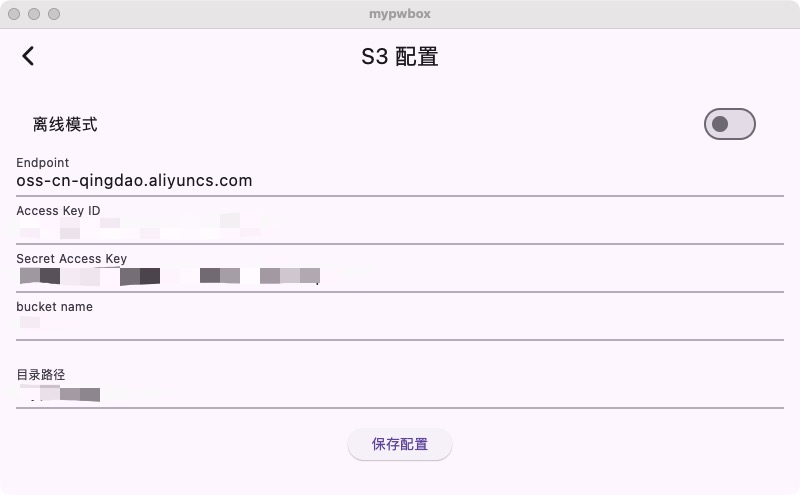
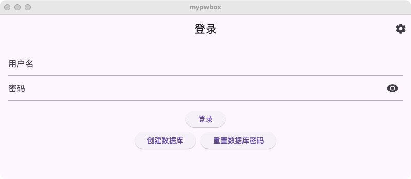
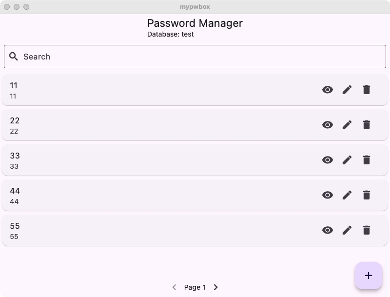

# mypwbox

mypwbox is a password management tool that supports backing up the database to object storage.

* [中文 README](https://github.com/vearne/mypwbox/blob/master/README_zh.md)

**Notice**: Critical passwords should not be stored in electronic documents; the safest way is to commit them to memory.


## Quickstart
### Get App package.
1) Direct download
   [release](https://github.com/vearne/mypwbox/releases)
2) build by yourself
```
make dmg
```
### Offline Mode
Offline mode is default

### Online Mode
Any object storage that supports the S3 protocol can be used
* AWS S3
* [Aliyun OSS](https://help.aliyun.com/zh/oss/user-guide/regions-and-endpoints)
* [Tencent COS](https://cloud.tencent.com/document/product/436/6224)
* MinIO



