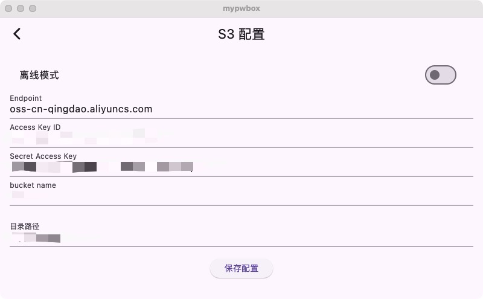

# mypwbox

mypwbox是一个密码管理工具，支持基于对象存储进行数据备份和同步。
* [README](https://github.com/vearne/mypwbox/blob/master/README.md)

**警告**: 关键密码不宜存储于电子文档中，最安全的方式是牢记于心。


## 使用
### 获取安装包
1) 直接下载
[release](https://github.com/vearne/mypwbox/releases)
2) 手动打包
```
make dmg
```
### 离线模式。
默认为离线模式
### 在线模式
支持S3协议的对象存储都可以使用
* AWS S3
* [Aliyun OSS](https://help.aliyun.com/zh/oss/user-guide/regions-and-endpoints)
* [Tencent COS](https://cloud.tencent.com/document/product/436/6224)
* MinIO



